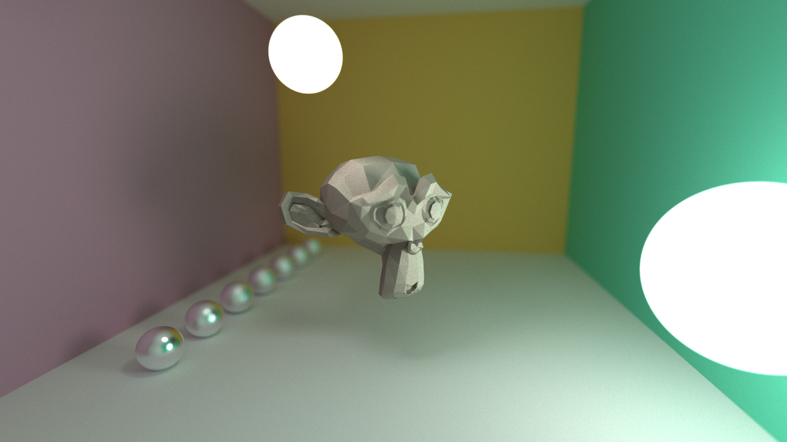

Building a rendering engine comes with a lot of hurdles. One of the problems that might pop out of nowhere (depending on your preparation) is handling meshes.

<!--more-->

Whenever you need to find the intersection of a ray with the scene you need to check _all_ objects. As long as the scene consists of a few of geometric primitives, e.g. a bunch of spheres and planes, everything is fine. However, once complex shapes need to be rendered, meshes are used which are made of hundreds or thousands of triangles. For instance, the [Suzanne](https://en.wikipedia.org/wiki/Blender_(software)#Suzanne,_the_%22monkey%22_mascot) head in the scene above consists of 968 triangles.

All rendering approaches need to find scene intersections. Here is the pseudo code for a very basic render engine:

1. Spawn a ray into the scene
2. Compute intersection with all objects, take closest intersection
3. Perform shading and retrieve color value

This has to be done for every pixel. Approaches like path tracing or other global illumination algorithms usually do not stop after the first intersection, but bounce multiple times through the scene. Additionally, they require multiple render passes for every pixel.

So, if computing intersections is required so often, how can meshes with thousands of triangles be rendered anyway?

By leveraging data structures and avoiding unnecessary computations for intersections. Methods of this kind are often called _bounding volume hierarchy_ (BVH) or, more generally, _acceleration structures_. Testing all triangles for an intersection is of linear complexity $$\mathcal{O}(n)$$, of course.

The triangles of an object mesh are often arranged in a compact manner. Before testing all triangles one can first test a box which encloses all triangles for intersection. This way all the frames passing by that object already save a lot of unnecessary computations. The computations for rays which actually hit that object can also be accelerated by decomposing that box further and further into a search tree. In the example below a binary search tree was built with [AABB](https://stackoverflow.com/questions/22512319/what-is-aabb-collision-detection)s. 

_In the best case_ testing such a bounding volume hierarchy has a complexity of $$\mathcal{O}(\log_2 n)$$. Unfortunately, a ray can hit mulitple boxes of an object, then mulitple branches of the search tree have to be evaluated. In the worst case the complexity is linear again. Consider a degenerate configuration where all triangles of a mesh are positioned along a line. For rays parallel to that line all branches and triangles have to be evaluated.

For developing the code to build BVHs, the following links proved useful to me:

* http://www.aaronperley.com/parallel-downsampling/
* https://medium.com/@bromanz/how-to-create-awesome-accelerators-the-surface-area-heuristic-e14b5dec6160

How to properly query such BVHs, I asked and answered on [stackoverflow](https://stackoverflow.com/questions/55479683/traversal-of-bounding-volume-hierachy-in-shaders). :grimacing:

So long! :call_me_hand:
