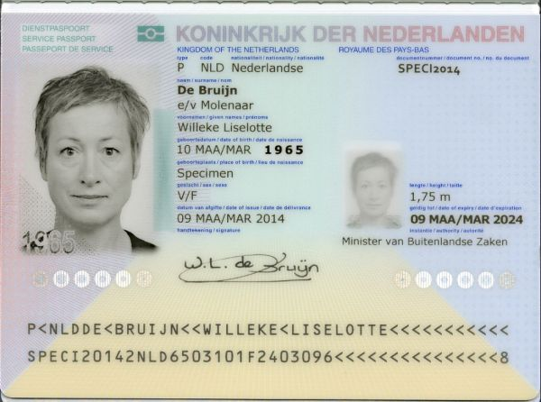
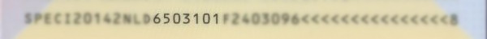
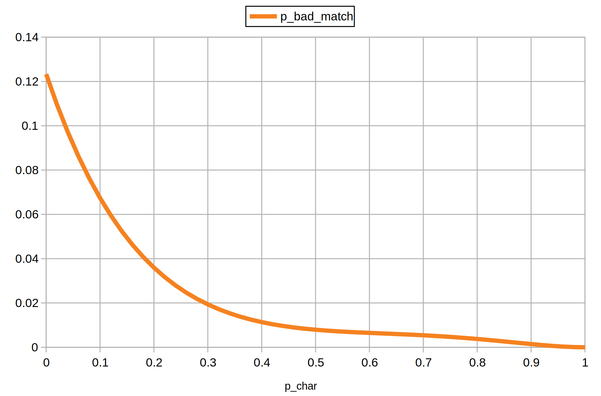
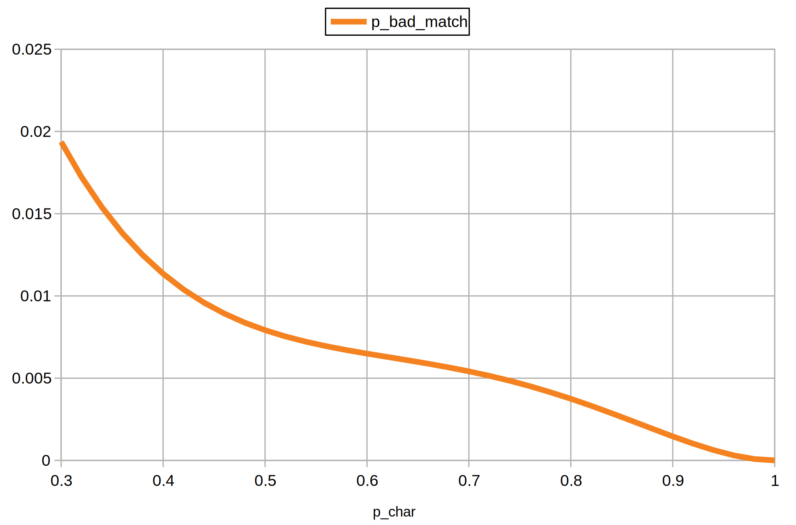

The machine readable zone (MRZ) of identity documents has various checksums which are intended to verify that a readout by a machine is actually correct. But how likely is it that this mechanism fails?

<!--more-->

### The ICAO Checksum Algorithm

Below is a specimen passport of the Netherlands. The last two lines with the characteristic `<` filler character make up the machine readable zone.

The second line of the MRZ contains - among other things - the birthday of the document holder. It is formatted as `YYMMDDC` where `C` is the checksum of the previous 6 characters.

To compute the checksum one needs to compute a weighted sum of the characters and take modulo 10. There are three weights: 7, 3, 1. They keep repeating until all characters are covered. Here is the checksum algorithm applied to the birthday field of this specimen MRZ:

$$
\begin{aligned}
c_7 &= (c_1 \cdot 7 + c_2 \cdot 3 + c_3 \cdot 1 + c_4 \cdot 7 + c_5 \cdot 3 + c_6 \cdot 1) \bmod 10 \\\
 &= (6 \cdot 7 + 5 \cdot 3 + 0 \cdot 1 + 3 \cdot 7 + 1 \cdot 3 + 0 \cdot 1) \bmod 10 \\\
 &= 81 \bmod 10 \\\
 &= 1 \\\
\end{aligned}
$$

That's it. The placeholder `<` has a value of 0 and for letters there exists a conversion to a value. This and other details can be found in [part 3 of the ICAO 9303 specification](https://www.icao.int/publications/Documents/9303_p3_cons_en.pdf).

### Robustness of the Checksum Verification

If an OCR algorithm reads the MRZ, i.e. converts the image into a string of characters, the checksum is intended to be used for verification of the readout correctness. Like in the example above, one can compute the checksum of the characters that were read and compare it to the checksum that was read. If they don't match, it is likely that something was read out incorrectly.

But is it possible that something is read incorrectly and the checksums still match?

To figure this out $p_{char}$ is introduced which denotes that a character is read correctly (not "flipped"). As a simplification, it is assumed that characters that can be read are 0 to 9. Before constructing an equation $p_{bad\_match}(p_{char})$ which represents the probability of a bad match (false positive), some observations are required.

### Observation #1 - The Checksum Computation can be Decomposed into Multiple Modulo Operations

Using the fact that a modulo operation has a [distributive property](https://math.stackexchange.com/a/2164001) the checksum computation can be rewritten like so:

$$
\begin{aligned}
c_7 &= (c_1 \cdot 7 + c_2 \cdot 3 + c_3 \cdot 1 + c_4 \cdot 7 + c_5 \cdot 3 + c_6 \cdot 1) \bmod 10 \\\
 &= ((c_1 \cdot 7) \bmod 10 + (c_2 \cdot 3) \bmod 10 + (c_3 \cdot 1) \bmod 10 + \ldots) \bmod 10 \\\
 &= c_{7^\prime} \bmod 10
\end{aligned}
$$

### Observation #2 - Modulo Remainders are Unique within 0...9

When computing and listing the remainders for possible characters, one can see that no remainder appears twice for a given weight:

| $c$   | $(c \cdot 7) \bmod 10$              | $(c \cdot 3) \bmod 10$              | $(c \cdot 1) \bmod 10$              |
| ----- | ----------------------------------- | ----------------------------------- | ----------------------------------- |
| 0     | 0                                   | 0                                   | 0                                   |
| 1     | 7                                   | 3                                   | 1                                   |
| 2     | 4                                   | 6                                   | 2                                   |
| 3     | 1                                   | 9                                   | 3                                   |
| 4     | 8                                   | 2                                   | 4                                   |
| 5     | 5                                   | 5                                   | 5                                   |
| 6     | 2                                   | 8                                   | 6                                   |
| 7     | 9                                   | 1                                   | 7                                   |
| 8     | 6                                   | 4                                   | 8                                   |
| 9     | 3                                   | 7                                   | 9                                   |

### Observation #3 - For any First Flip, there is 1 Possibility for a Second Flip to Cancel it Out

This is possible because of observations #1 and #2. Let's consider the example from above again: `6503101`

If we flip the first character (weight 7) from `6` to `8` the contribution of the first character to $c_{7^\prime}$ is changed by $-2 + 6 = +4$. If we flip the second character (weight 3) from `5` to `7` it changes the contribution of the second character by $-5 + 1 = -4$. Both changes in contribution taken together cancel out, i.e. the checksum $c_7$ does not change.

So, if instead of `6503101` the readout is `8703101`, then the computed and read checksums would still match and the incorrect readout would not be detected. In a similar style cancelling flips can be constructed for each initial flip.

### Observation #4 - Mathematically the Checksum Character can be Treated like the Other Characters

This is an extension of observation #3. If the one of the flipping characters is the checksum character itself, the same argument applies. If any of the non checksum characters flip, it definitely will lead to a different computed checksum. This means if the checksum character of the readout is flipped to this new computed checksum, both match and the incorrect readout would not be detected.

The other way around works also, in this case the second character flip needs to happen in a way that the change in the checksum is cancelled.

### Observation #5 - If a single character flips the Checksums don't Match

This follows from observations #1 and #2. If only one character flips there will be a change in contribution to $c_{7^\prime}$ for each possibility, so in any case the computed and read checksum will differ and the incorrect readout would be detected.

### Construction of $p_{badmatch}(p_{char})$

The probability of matching checksums for flipped characters can be constructed as sum of the probabilities for the amount of flips weighted by the respective probability that the flip will not be detected:

$$
\begin{aligned}
p_{badmatch}(p_{char}) = ~ & {p_{char}}^{n-1} \cdot (1 - p_{char})^1 \cdot p_{undetectedflips=1} ~ + \\\
& {p_{char}}^{n-2} \cdot (1 - p_{char})^2 \cdot p_{undetectedflips=2} ~ + \\\
& {p_{char}}^{n-3} \cdot (1 - p_{char})^3 \cdot p_{undetectedflips=3} ~ + \\\
& \ldots
\end{aligned}
$$

From observation #5 it is known that:

$$
\begin{aligned}
p_{undetectedflips=1} = 0
\end{aligned}
$$

From observation #3 it is known that:

$$
\begin{aligned}
p_{undetectedflips=2} = \frac{9 \cdot 1}{9 \cdot 9} = \frac{1}{9}
\end{aligned}
$$

From observation #3 it is also known that for 3 flips, the second flip needs to _not_ cancel the contribution, i.e. there are 8 possible flips for it:

$$
\begin{aligned}
p_{undetectedflips=3} = \frac{9 \cdot 8 \cdot 1}{9 \cdot 9 \cdot 9} = \frac{8}{81}
\end{aligned}
$$

This can be generalized for a flip count that is greater than 1:

$$
\begin{aligned}
p_{undetectedflips=k} = \frac{9 \cdot 8^{k - 2} \cdot 1}{9^k} ~~ \textrm{for} ~~ k \gt 1
\end{aligned}
$$

It needs to be noted here that this formula is not exhaustive. Cases where multiple subsets of flips do cancel out, are not covered, i.e. for 4 flips it is possible that 2x2 flips cancel out. This also means that the real probability of undetected flips is higher. Sorry, but I am not sure how to fit this in some concise equation :slightly_frowning_face:

Moving on, the somewhat imprecise equation for undetected flips can be assembled as:

$$
\begin{aligned}
p_{badmatch}(p_{char}) = \sum_{i=2}^n {p_{char}}^{n-i} \cdot (1 - p_{char})^i \cdot \frac{9 \cdot 8^{i - 2} \cdot 1}{9^i}
\end{aligned}
$$

For $n = 7$ the plot of this function looks like this:

Here is a zoomed version:

This confirms the initial intuiton that undetected flips are quite rare, especially for a good OCR engine with $p_{char} \geq 0.95$. Also within the MRZ there are multiple checksums and usually one that spans multiple data fields which further decreases the probability of undetected flips.

