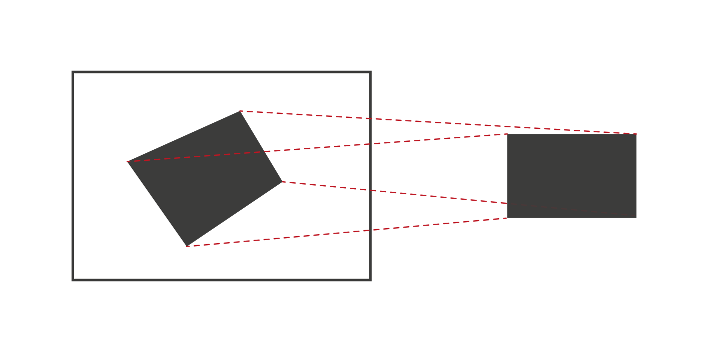
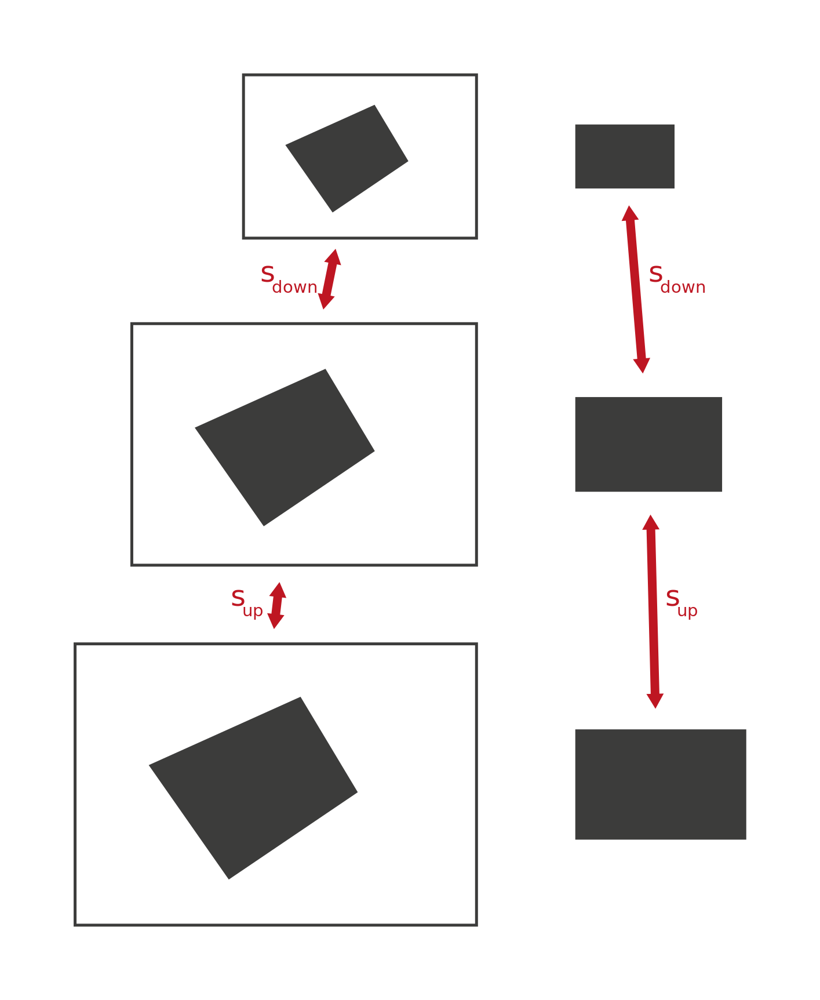
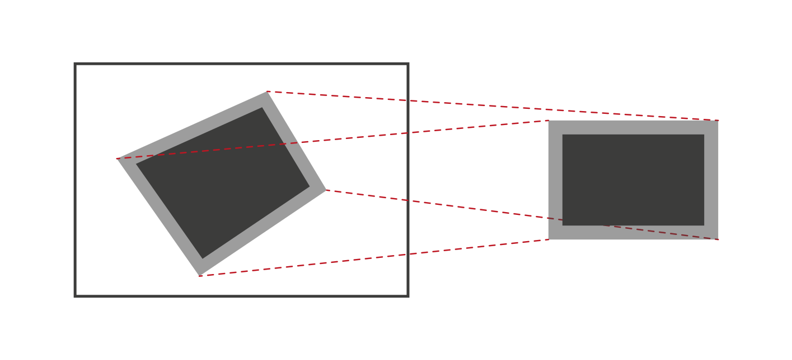

This is writeup of some formulas that proofed to be helpful understanding and working with homographies.

<!--more-->

It is based on some notes I made along the last few years. I apologize upfront for missing references and bad notation.

&nbsp;

## Solving for a Homography Given 2D Correspondences

To solve for a homography 4 correspondences are required. Given the locations of these points it is possible to construct a linear
equation system and solve for the entries of the homography matrix.

The relation between the image points and the homography is given by:

$$
\begin{aligned}
\begin{pmatrix} X_i \\ Y_i \end{pmatrix} = \Pi \left( H \begin{pmatrix} x_i \\ y_i \\ 1 \end{pmatrix} \right)
 = \Pi \left( \begin{pmatrix} h_{11} & h_{12} & h_{13} \\ h_{21} & h_{22} & h_{23} \\ h_{31} & h_{32} & h_{33} \end{pmatrix} \begin{pmatrix} x_i \\ y_i \\ 1 \end{pmatrix} \right)
\end{aligned}
$$

The homography is a 3x3 matrix which maps from the domain of $$\left(\begin{smallmatrix} x_i \\ y_i \end{smallmatrix}\right)$$ to $$\left(\begin{smallmatrix} X_i \\ Y_i \end{smallmatrix}\right)$$. It works on homogeneous coordinates which is why a 1 was added above. $$\Pi$$ denotes the perspective projection which maps 3d vectors into 2d by dividing by its third component:

$$
\begin{aligned}
\Pi \left( \begin{pmatrix} x \\ y \\ z \end{pmatrix} \right) &= \frac{1}{z} \begin{pmatrix} x \\ y \end{pmatrix} \\
\end{aligned}
$$

To use the correspondences of the target domain the perspective projection needs to be undone. Therefore we consider the direct output of the matrix multiplication with $$H$$:

$$
\begin{aligned}
\begin{pmatrix} \tilde{X}_i \\ \tilde{Y}_i \\ \tilde{Z}_i \end{pmatrix} = \begin{pmatrix} X_i \cdot \tilde{Z}_i \\ Y_i \cdot \tilde{Z}_i \\ \tilde{Z}_i \end{pmatrix} = H \begin{pmatrix} x_i \\ y_i \\ 1 \end{pmatrix}
\end{aligned}
$$

Now it is time to expand the matrix multiplication, so we get 3 equations:

$$
\begin{aligned}
X_i \cdot \tilde{Z}_i &= h_{11} x_i + h_{12} y_i + h_{13} \\
Y_i \cdot \tilde{Z}_i &= h_{21} x_i + h_{22} y_i + h_{23} \\
\tilde{Z}_i &= h_{31} x_i + h_{32} y_i + h_{33}
\end{aligned}
$$

The next steps are not that obvious IMO:

1. Since the correspondences are only available in the 2d space the third equation above itself does not help to solve for unknowns, this means we have 2x4 equations for 9 unknowns and the solution is up to scale. In this case we can just fix one of the matrix values and be done with it, a common choice is $$h_{33} = 1$$

2. With this additional constraint we can plug the equation for $$\tilde{Z}_i$$ in the other equations and arrange them in a way that all $$H$$ related terms are on one side and all other terms are on the opposite side

$$
\begin{aligned}
\\
X_i \cdot \left( h_{31} x_i + h_{32} y_i + 1 \right) &= h_{11} x_i + h_{12} y_i + h_{13} \\
h_{31} x_i X_i + h_{32} y_i X_i + X_i &= h_{11} x_i + h_{12} y_i + h_{13} \\
X_i &= h_{11} x_i + h_{12} y_i + h_{13} - h_{31} x_i X_i - h_{32} y_i X_i \\ \\
Y_i \cdot \left( h_{31} x_i + h_{32} y_i + 1 \right) &= h_{21} x_i + h_{22} y_i + h_{23} \\
h_{31} x_i Y_i + h_{32} y_i X_i + Y_i &= h_{21} x_i + h_{22} y_i + h_{23} \\
Y_i &= h_{21} x_i + h_{22} y_i + h_{23} - h_{31} x_i Y_i - h_{32} y_i Y_i
\\
\end{aligned}
$$

With all four pairs of equations ($$i = 1, 2, 3, 4$$), it is possible to construct one large linear equation system where the unknown entries of the homography are stacked in a vector:

$$
\begin{pmatrix} X_1 \\ X_2 \\ X_3 \\ X_4 \\ Y_1 \\ Y_2 \\ Y_3 \\ Y_4 \end{pmatrix} =
\begin{pmatrix}
x_1 & y_1 & 1 & 0 & 0 & 0 & -x_1 X_1 & -y_1 X_1 \\
x_2 & y_2 & 1 & 0 & 0 & 0 & -x_2 X_2 & -y_2 X_2 \\
x_3 & y_3 & 1 & 0 & 0 & 0 & -x_3 X_3 & -y_3 X_3 \\
x_4 & y_4 & 1 & 0 & 0 & 0 & -x_4 X_4 & -y_4 X_4 \\
0 & 0 & 0 & x_1 & y_1 & 1 & -x_1 Y_1 & -y_1 Y_1 \\
0 & 0 & 0 & x_2 & y_2 & 1 & -x_2 Y_2 & -y_2 Y_2 \\
0 & 0 & 0 & x_3 & y_3 & 1 & -x_3 Y_3 & -y_3 Y_3 \\
0 & 0 & 0 & x_4 & y_4 & 1 & -x_4 Y_4 & -y_4 Y_4 \\
\end{pmatrix} \cdot
\begin{pmatrix} h_{11} \\ h_{12} \\ h_{13} \\ h_{21} \\ h_{22} \\ h_{23} \\ h_{31} \\ h_{32} \end{pmatrix}
$$

This is nice because now common math machinery can be thrown at this problem. The matrix needs to be inverted, then only a matrix multiplication is left to solve for the homography entries:

$$
\begin{aligned}
\vec{k} &= M \vec{h} \\
M^{-1}\vec{k} &= \vec{h}
\end{aligned}
$$

Once this is done the elements of $$\vec{h}$$ and $$h_{33}$$ (or whatever element was fixed) can be arranged into a matrix again. Then the homography can be used to project points from one domain to another. Of course, the usual requirements for matrix inversion also apply here, i.e. $$M$$ needs to exhibit linear independence, for instance this is not given if two correspondence pairs are identical.

This kind of approach is called _Direct Linear Transform_ (DLT) in literature. It is only a viable approach if the correspondences are sufficiently precise. Robust homography estimation is usually done with more than 4 correspondences and using RANSAC-style methods which can cope with incorrect correspondences.

To conclude, here is an implementation in Python:


from typing import Optional
import numpy as np

def dlt(src: np.ndarray, dst: np.ndarray) -> Optional[np.ndarray]:
    assert src.shape == (4, 2)
    assert dst.shape == (4, 2)

    m = np.zeros((8, 8))
    m[0:4, 0] = m[4:8, 3] = src[:, 0]
    m[0:4, 1] = m[4:8, 4] = src[:, 1]
    m[0:4, 2] = m[4:8, 5] = src[:, 2]
    m[0:4, 6] = - src[:, 0] * dst[:, 0]
    m[0:4, 7] = - src[:, 1] * dst[:, 0]
    m[4:8, 6] = - src[:, 0] * dst[:, 1]
    m[4:8, 7] = - src[:, 1] * dst[:, 1]

    try:
        m_inv = np.linalg.inv(m)
    except np.linalg.LinAlgError:
        return None

    k = np.concatenate((dst[:, 0], dst[:, 1]))
    h = np.dot(m_inv, k)
    return np.reshape(np.concatenate((h, [1])), (3, 3))


&nbsp;

## Transforming Existing Homographies

### Use a Homography for Different Scales

Consider a homography is computed on a certain scale, but it is used on a different scale. A concrete example is running tracking algorithms (e.g. keypoint based) on a smaller scale than the input to keep everything efficient, but then doing some kind of visualization on the original scale:

Consider points that are on a different scale relative to the scale where the homography was computed on:

$$
\begin{aligned}
\begin{pmatrix} X^\prime \\ Y^\prime \end{pmatrix} &= s_1 \begin{pmatrix} X \\ Y \end{pmatrix} \\ \\
\begin{pmatrix} x^\prime \\ y^\prime \end{pmatrix} &= s_2 \begin{pmatrix} x \\ y \end{pmatrix}
\end{aligned}
$$

The objective is now to transform the homography in a way that the scaling does not need to be done before/after applying the homography. For starters let's plug the scaled version into the basic equation:

$$
\begin{aligned}
\frac{1}{s_1} \begin{pmatrix} X^\prime \\ Y^\prime \end{pmatrix} = \Pi \left( H \frac{1}{s_2} \begin{pmatrix} x^\prime \\ y^\prime \\ s_2 \end{pmatrix} \right)
\end{aligned}
$$

When expanding the equation, $$\frac{1}{s_1}$$ can be moved on the other side while maintaining the original structure of the equation:

$$
\begin{aligned}
\begin{pmatrix} X^\prime \\ Y^\prime \end{pmatrix} &= s_1 \Pi \left( H \frac{1}{s_2} \begin{pmatrix} x^\prime \\ y^\prime \\ s_2 \end{pmatrix} \right) \\
&= s_1 \Pi \left( \begin{pmatrix} \frac{1}{s_2} h_{11} x^\prime + \frac{1}{s_2} h_{12} y^\prime + h_{13} \\ \frac{1}{s_2} h_{21} x^\prime + \frac{1}{s_2} h_{22} y^\prime + h_{23} \\ \frac{1}{s_2} h_{31} x^\prime + \frac{1}{s_2} h_{32} y^\prime + h_{33} \end{pmatrix} \right) \\
&= s_1 \frac{1}{\frac{1}{s_2} h_{31} x^\prime + \frac{1}{s_2} h_{32} y^\prime + h_{33}} \begin{pmatrix} \frac{1}{s_2} h_{11} x^\prime + \frac{1}{s_2} h_{12} y^\prime + h_{13} \\ \frac{1}{s_2} h_{21} x^\prime + \frac{1}{s_2} h_{22} y^\prime + h_{23} \end{pmatrix} \\
&= \frac{1}{\frac{1}{s_2} h_{31} x^\prime + \frac{1}{s_2} h_{32} y^\prime + h_{33}} \begin{pmatrix} \frac{s_1}{s_2} h_{11} x^\prime + \frac{s_1}{s_2} h_{12} y^\prime + s_1 h_{13} \\ \frac{s_1}{s_2} h_{21} x^\prime + \frac{s_1}{s_2} h_{22} y^\prime + s_1 h_{23} \end{pmatrix} \\
&= \Pi \left( H_s \begin{pmatrix} x^\prime \\ y^\prime \\ 1 \end{pmatrix} \right)
\end{aligned}
$$

Now it is possible to read off the entries of a modified homography $$H_s$$ that maps between the scaled domains:

$$
H_s = \begin{pmatrix}
\frac{s_1}{s_2} h_{11} & \frac{s_1}{s_2} h_{12} & s_1 h_{13} \\
\frac{s_1}{s_2} h_{21} & \frac{s_1}{s_2} h_{22} & s_1 h_{23} \\
\frac{1}{s_2} h_{31} & \frac{1}{s_2} h_{32} & h_{33}
\end{pmatrix}
$$

This is a generalization of a [Stackoverflow answer](https://stackoverflow.com/a/48915151) I submitted some years ago (on Stackoverflow only the case $$s = s_1 = s_2$$ is covered and the usage of scales is inverted). Depending on the exact usecase doing the computations on the original scale and only scaling the resulting geometry to your desired scale might be more straightforward. Also recomputing the homography with the DLT instead of modifying the existing one is an easy option. However, if you feel nerdy and want to make your code harder to read feel free to use this :upside_down_face:


import numpy as np

def scale_homography(h: np.ndarray, s_src: float,
                     s_dst: float) -> np.ndarray:
    assert h.shape == (3, 3)
    h2 = h.copy()
    h2[:2, :] /= s_src
    h2[:, :2] *= s_dst
    return h2


&nbsp;

### Use a Homography for a Shifted Anchor

Consider a homography is computed for a quad correspondence and the objective is to warp images into the original image _outside_ of the quad. When using [`cv.warpPerspective`](https://docs.opencv.org/4.5.5/da/d54/group__imgproc__transform.html#gaf73673a7e8e18ec6963e3774e6a94b87) it is only possible to warp to the right and bottom of the original domain, essentially everywhere where pixel indices are positive (remember that image coordinate systems are in the top left, positive x is rightwards and positive y is downwards). A remedy to this is to compute a homography which does already cover area to the left and top of the original quad.

This time it is only required to introduce new variables for the source domain:

$$
\begin{pmatrix} x^\prime \\ y^\prime \end{pmatrix} = \begin{pmatrix} x + t_x \\ y + t_y \end{pmatrix}
$$

The modus operandi remains the same, let's plug this new relation in the basic equation, rearrange and read off the new homography:

$$
\begin{aligned}
\begin{pmatrix} X \\ Y \end{pmatrix} &= \Pi \left( H \begin{pmatrix} x^\prime - t_x \\ y^\prime - t_y \\ 1 \end{pmatrix} \right) \\
&= \Pi \left( \begin{pmatrix} h_{11} \left( x^\prime - t_x \right) + h_{12} \left( y^\prime - t_y \right) + h_{13} \\ h_{21} \left( x^\prime - t_x \right) + h_{22} \left( y^\prime - t_y \right) + h_{23} \\ h_{31} \left( x^\prime - t_x \right) + h_{32} \left( y^\prime - t_y \right) + h_{33} \end{pmatrix} \right) \\
&= \Pi \left( \begin{pmatrix} h_{11} x^\prime + h_{12} y^\prime + h_{13} - h_{11} t_x - h_{12} t_y \\ h_{21} x^\prime + h_{22} y^\prime + h_{23} - h_{21} t_x - h_{22} t_y \\ h_{31} x^\prime + h_{32} y^\prime + h_{33} - h_{31} t_x - h_{32} t_y \end{pmatrix} \right) \\
&= \Pi \left( H_t \begin{pmatrix} x^\prime \\ y^\prime \\ 1 \end{pmatrix} \right)
\end{aligned}
$$

In this case the modified homography is:

$$
H_t = \begin{pmatrix}
h_{11} & h_{12} & h_{13} - h_{11} t_x - h_{12} t_y \\
h_{21} & h_{22} & h_{23} - h_{21} t_x - h_{22} t_y \\
h_{31} & h_{32} & h_{33} - h_{31} t_x - h_{32} t_y
\end{pmatrix}
$$

For this usecase a pragmatic, less elegant alternative exists as well. One can project the 4 vertices of the image to be warped using the initial homography. After that one can recompute the homography using the corners of the warp image and the projected vertices as correspondences with the DLT.


import numpy as np

def shift_homograpy(h: np.ndarray, tx: float,
                    ty: float) -> np.ndarray:
    assert h.shape == (3, 3)
    h2 = h.copy()
    h2[:, 2] -= h2[:, 0] * tx + h2[:, 0] * tx + h2[:, 1] * ty
    return h2

