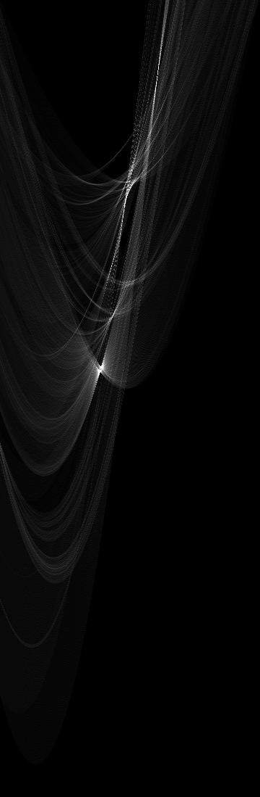
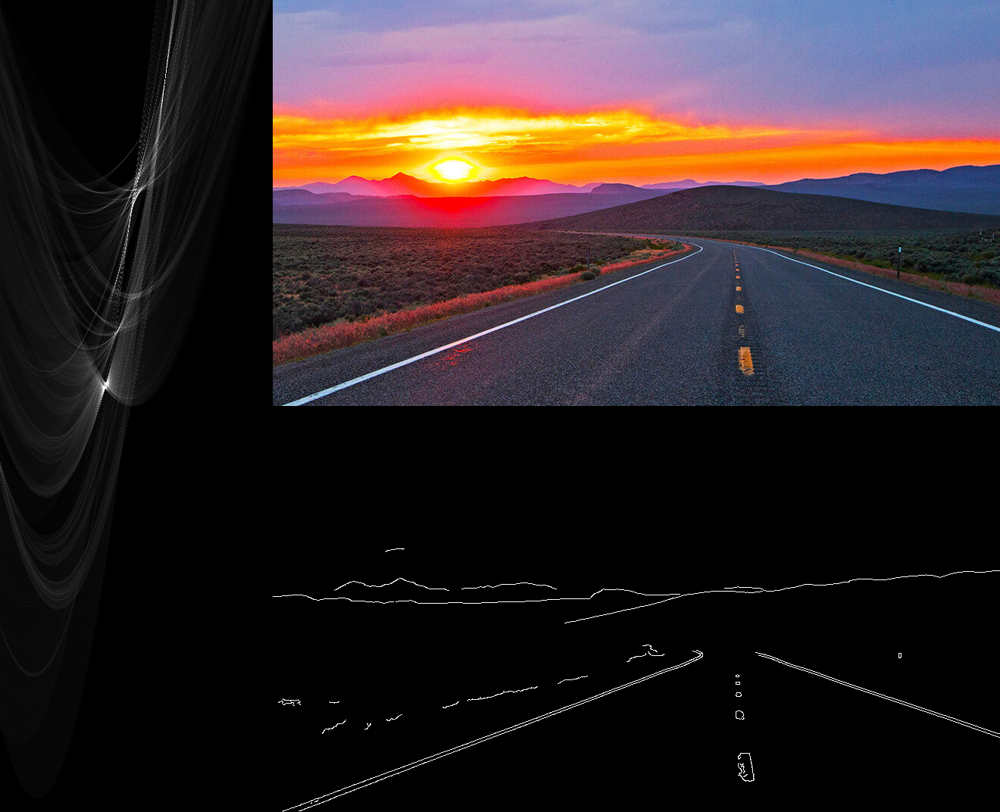
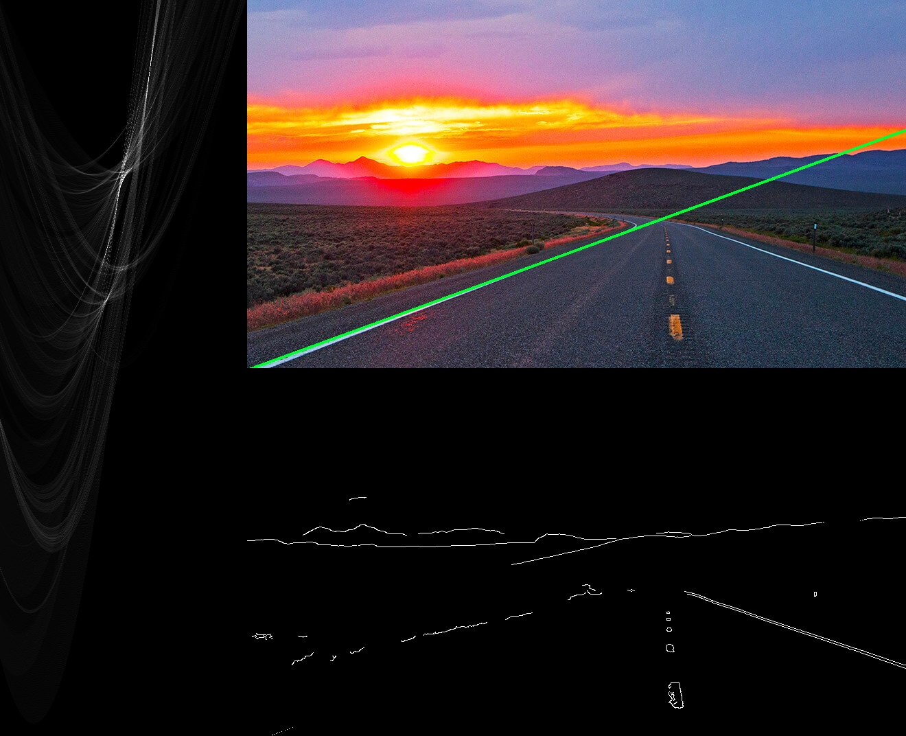
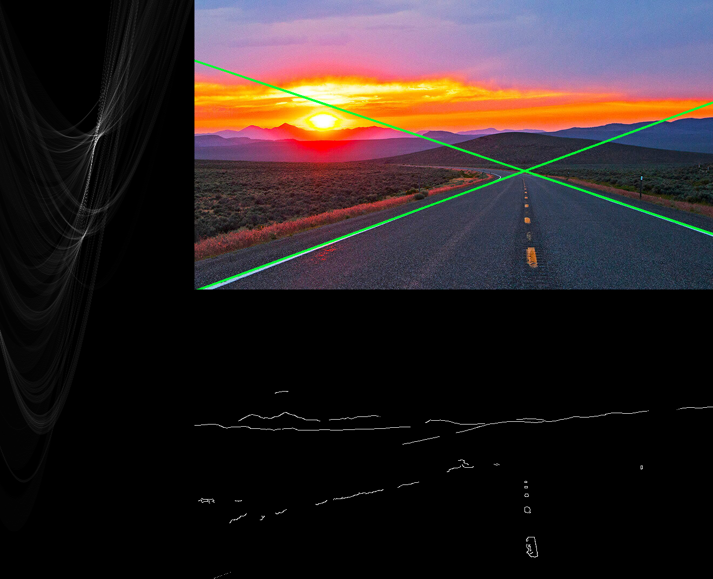

Detecting the longest line in an Hough accumulator is easy, however detecting multiple lines is a more annoying problem.

<!--more-->

### Hough Transform Recap

The Hough transform is a brute force method for line detection. In simple terms for each given non-zero pixel in a binarized image it generates all possible lines and counts ("votes") how often each line occurs. To this end lines are represented in [normal form](https://en.wikipedia.org/wiki/Line_(geometry)#Hesse_normal_form):

$$
\rho = x \cos \theta + y \sin \theta
$$

For implementation a set of discrete values for $$\rho$$ and $$\theta$$ are chosen and using the above formula the corresponding $$\rho$$ values are computed and discretized. Then, in an accumulator array that represents the possible line configurations, votes are collected. The more votes a set of parameters $$(\rho, \theta)$$ has, the more points in the binarized image lay on this line.

An efficient numpy implementation is given below:


@dataclass
class HoughAccumulator:
    row_index_to_rho: Sequence[float]
    col_index_to_theta_rad: Sequence[float]
    rho_resolution: float
    theta_resolution: float
    votes: npt.NDArray[np.int32]

    # ... see full script for more methods

    def add_votes(self, binarized_image: npt.NDArray[np.uint8]) -> None:

        # get indices of non-zero pixels
        y_indices, x_indices = np.indices(binarized_image.shape)
        mask = binarized_image > 0
        x = x_indices[mask].reshape(-1, 1)
        y = y_indices[mask].reshape(-1, 1)
        n = np.prod(x.shape)

        # setup theta array in a way that in a single operation
        # thetas are computed for all pixels
        # (each pixel needs to be combined with all thetas)
        theta_count = len(self.col_index_to_theta_rad)
        thetas = (np.tile(self.col_index_to_theta_rad, n)
                  .reshape(n, -1))
        theta_indices = (np.tile(np.arange(theta_count), n)
                         .reshape(n, -1).astype(np.int32))

        # based on the normal form equation rho can be computed
        # afterward it needs to be discretized to match
        # the accumulator resolution
        rho_count = len(self.row_index_to_rho)
        rho_values = x * np.cos(thetas) + y * np.sin(thetas)
        rho_indices = (np.around(rho_values / self.rho_resolution)
                       .astype(np.int32))

        # out of bounds indices are ignored
        # 2d indices are converted to 1d, so counting is simple
        # finally the accumulator is updated with the counted votes
        rho_indices_flat = rho_indices.flatten()
        theta_indices_flat = theta_indices.flatten()
        flat_mask = ((rho_indices_flat >= 0) &
                     (rho_indices_flat < rho_count) &
                     (theta_indices_flat >= 0) &
                     (theta_indices_flat < theta_count))
        flat_indices = np.ravel_multi_index(
            (rho_indices_flat[flat_mask],
             theta_indices_flat[flat_mask]),
            self.votes.shape
        )
        counts = np.bincount(flat_indices)
        counts_mask = counts > 0
        idx = np.arange(len(counts))
        self.votes.flat[idx[counts_mask]] += counts[counts_mask]


### So What's the Deal?

When finding the longest ("strongest") line in the Hough space, it's rather easy. With argmax the corresponding $$\rho_{argmax}$$ and $$\theta_{argmax}$$ can be found.

However, when multiple lines are supposed to be detected, things get a bit more complicated. Typically points in a binarized image are contributing to multiple lines in vicinity of the true line, so the signal in the Hough space is not a single entry. Lines are local maxima in the Hough space, however these are not necessarily strictly increasing in their neighborhood. Below is a visualization of an Hough accumulator, the x-axis represents $$\theta$$ and the y-axis $$\rho$$, the more votes a line has, the brighter it is:

If multiple lines need to be found, this requires finnicky searching through the Hough space and often leads to multiple line candidates per "true" line. For instance in OpenCV's implementation local maximas are found by [checking the 4-connected neighbors of a line](https://github.com/opencv/opencv/blob/725e440d278aca07d35a5e8963ef990572b07316/modules/imgproc/src/hough.cpp#L95-L108). There exists another, [probabilistic implementation of the Hough transform](https://docs.opencv.org/4.7.0/dd/d1a/group__imgproc__feature.html#ga46b4e588934f6c8dfd509cc6e0e4545a), however it also does not allow more control over the line picking.

### Hough, Pick, Erase and Repeat 🔁

A simple, but surprisingly robust method to find multiple lines boils down to the following steps:

1. process the binarized image with the Hough transform
2. find the maximum in the Hough space or stop if the minimum requirements is not met for any line
3. remove the line from the binarized image and go to step 1

(in a more sophisticated version a "delta hough transform" can be implemented and used to update the Hough space instead of recomputing it every step)

### Demo

(https://travelnevada.com/wp-content/uploads/2021/03/Highway50_Desktop.jpg)

Processing above image with the described algorithm, we can generate the following images that show the intermediate steps (Hough space on the left, binarized image below). Notice that each line in the binarized image is removed and how the maxima plus more is disappearing in the Hough space every iteration. The script to generate the images including the Hough numpy implementation can be found [here](data/simple_hough_multiline.py).

Step #0

Step #1

Step #2

