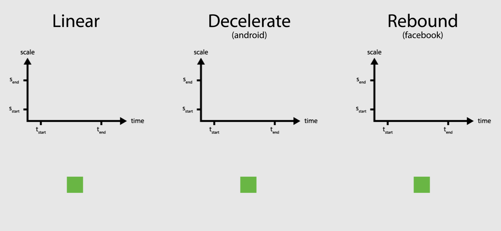
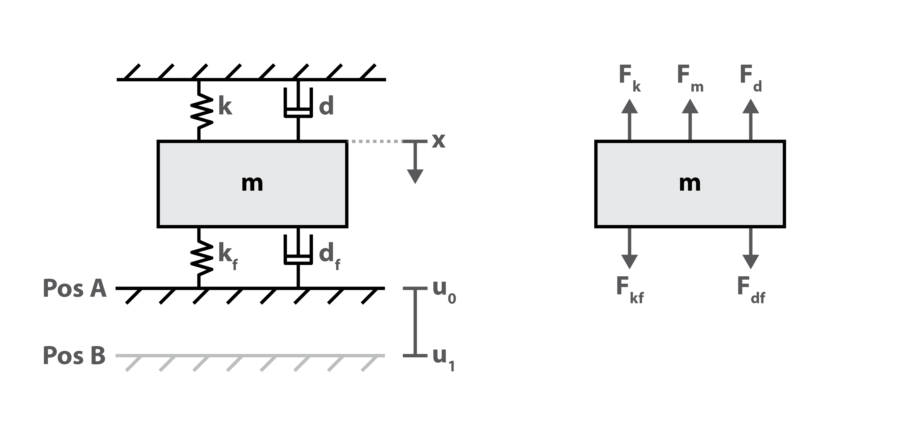
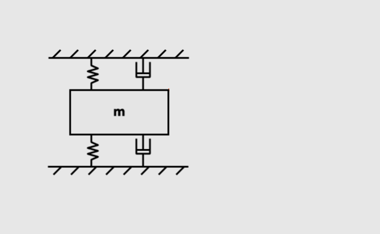
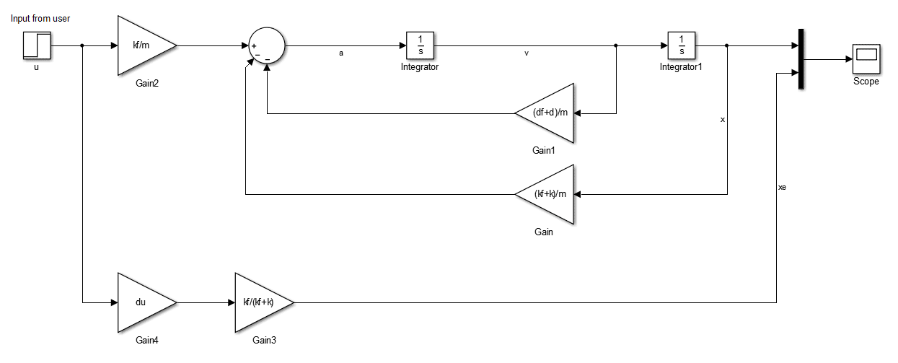
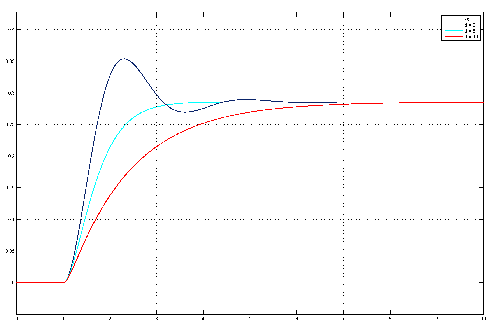
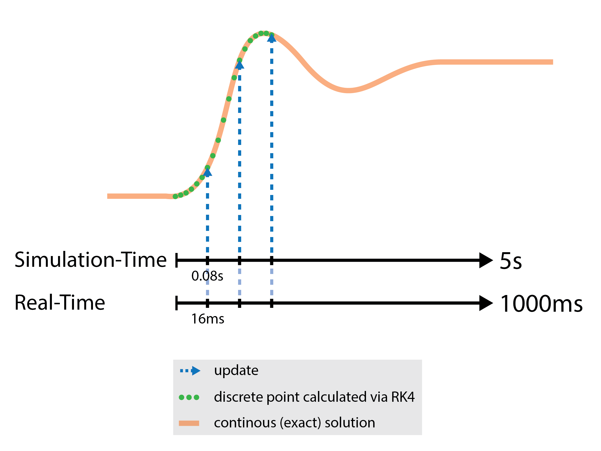
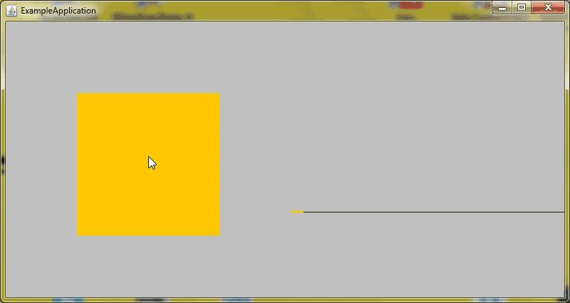

[Rebound](http://facebook.github.io/rebound/) is an open-source project by Facebook. It is used to control the course of animations. In case you are familiar with Android, you might know that Android provides several `Interpolator` classes (`AccelerateInterpolator`, `DecelerateInterpolator`, ...) to handle that task. While most of these provide a rather simple course of animation, Facebook's Rebound is based on _spring dynamics_ which is not trivial to implement. This article describes my attempt to reverse engineer the Rebound library. Of course, it is open source, but I did not take a look at it, you gotta believe me there :grimacing:. The finished project can be found on [Github](https://github.com/osanj/spring-interpolator).

## Interpolators in UIs

The task of an animation is to visually transition a graphic object from a start state to an end state. Usually these states differ in the values of an attribute, e.g. scale a button from 50% to 100% to get the user's attention. The transition happens over time from its inital value to its final value. Interpolators encode the mathematical relation which is used to carry out that transition [1]. A linear relation is the most basic one, but there exist more sophisticated interpolators, too.

In code animations are often containers and the interpolator logic is encapsulated in a separate class. The output of the interpolator is normalized between $0$ and $1$ (sometimes it can also be $<0$ and/or $>1$). Consider the following pseudo Java code:


public class Animation {
	
	private long durationMillis;
	private long startMillis;
	private float startScale; // start value of attribute (e.g. 0.5)
	private float destScale; // end value of attribute (e.g. 1.0)
	private UiRect rect; // object to be manipulated
	private Interpolator interpolator;
	
	
	public Animation(long duration, UiRect rect, float destScale){
		this.durationMillis = duration;
		this.startMillis = System.currentTimeMillis();
		
		this.rect = rect;
		this.startScale = rect.getScale();
		this.destScale = destScale;
	
		interpolator = new Interpolator();
	}
	
	// called every 16ms (60fps)
	public void onAnimate(){
		long t = System.currentTimeMillis();

		// normalized value of time (0 ... 1)
		float animationTime = (t - startMillis) / durationMillis;
		
		// normalized value for setting the scale (0 ... 1)
		float scaleFactor = interpol.getValue(animationTime);
		
		// manipulating UI-object
		float scaleDelta = scaleFactor * (destScale - startScale);
		rect.setScale(startScale + scaleDelta);
	}
}


## A Mechanical Concept

I started with the characteristic curve of the Rebound interpolator. You can reproduce it by clicking the demo on the [website](http://facebook.github.io/rebound/") of Rebound. A different way to experience it, is to maximize/minimize a Chat Head of Facebooks Messenger.

As a starting point I tried to find a mechanical concept which could show a similiar motion. I came up with following configuration:

As you can see it's a mass attached to two fixed boards (these won't oscillate). The connections are done with a spring and a damper. To get the system oscillating an external stimulation is necessary. That "input" is realized by instantaneously lowering the the bottom board (`Pos B`) which causes the equilibrium to shift to another state. The system is now in an non-equilibrium state and will move to the new one. The motion of the mass $x$ then should be the desired curve.

In the context of an interpolator for animations moving the board from one position to the other is triggered when the animation should start playing, for example the user clicking a button.

## Concept Validation with Simulink

In order to proof the concept I used MatLab and Simulink to simulate it. Therefore the equation of motion of the system had to be determined. One does this by setting up the balance of forces which affect the mass. Replacing the forces with the respective formulas leads to an ordinary differential equation of second order.

$$
\begin{aligned}
F_k + F_d + F_m & = F_{kf} + F_{df} \\\ \\\
k x + d \dot{x} + m \ddot{x} & = k_f (- x + u \cdot d_u) - d_f \dot{x}
\end{aligned}
$$

Remember that the force of a spring is proportional to its extension. That means compressing the spring results in a negative force. When switching the position of the bottom board to `Pos B`, it will instantly extend the spring which changes $F_{kf}$ and therefore stimulate the system.
To represent this system in Simulink rearranging the equation as a formula of the highest order of $x$ is helpful.

$$
\begin{aligned}
\ddot{x} & = -\dot{x}\left(\frac{d_f + d}{m} \right) - x\left(\frac{k_f + k}{m} \right) + d_u u\frac{k_f}{m}
\end{aligned}
$$

Also the final position $x_e$ of the mass is important to normalize $x$ later. The system needs to be in an equilibrium after the stimulation, i.e. $t \rightarrow \infty$. Then all derivatives of $x$ are zero: $\dot{x} = \ddot{x} = 0$. That simplifies the equation:

$$
\begin{aligned}
k x + d \dot{x} + m \ddot{x} & = k_f (- x + u \cdot d_u) + d_f \dot{x} \\\ \\\
k x & = - k_f x + k_f d_u u \\\ \\\
x (k + k_f) & = k_f d_u u\\\ \\\
x & = \frac{k_f}{k + k_f} d_u \cdot u = x_e
\end{aligned}
$$

The rearranged equation of motion is easily represented in a Simulink model. As discussed before $u$ is the only way to influence the system from the outside. Switching it between $0$ and $1$ leads system stimulation. Later this variable will also be found in the implementation, of course. For the validation the common [step function](https://en.wikipedia.org/wiki/Heaviside_step_function) was used. Observing $x$ we can reproduce a similar pattern like the one which can be found on the website of Rebound. The intensity of the oscillation depends on the parametrization of the system.

I started with following configuration
* $m = 1$
* $k = 5$
* $d = 0.5$
* $k_f = 2$
* $d_f = 0.2$
* $d_u = u_0 - u_1 = 1$

For the implementation I decided to keep $m$, $k_f$, $d_f$ and $u_1$ fixed. It is sufficient to make $d$ and $k$ variable to make the curve "adjustable" (see the image above). If you want to do some experiments yourself, check out the [Simulink file](data/simulink_mech_concept.slx).

## Solving the ODE with Runge-Kutta

There exist various methods for solving an Ordinary Differential Equation (ODE) numerically. One very common one is Runge-Kutta of 4th order (RK4). Those methods are usually defined for ODEs of first order:

$$
\begin{aligned}
z'(t) & = f(t,z(t))
\end{aligned}
$$

To understand the basic principle, here is an example:

$$
\begin{aligned}
y' & = x \cdot y = f(x,y) \\\ \\\
m_0 & = f(x_0,y_0)
\end{aligned}
$$

The ODE allows to compute the slope of $y$ for each configuration of $x$ and $y$. In order to solve the ODE we need an initial condition which is also included above. When solving this equation numerically for each step (in this case steps of $x$) the slope is computed and the next value of $y$ is determined. Solving it numerically/recursively would look like this:

$$
\begin{aligned}
m_0 & = x_0 \cdot y_0 \\\ \\\
y_1 & = m_0 \cdot h + y_0 \\\ \\\
m_1 & = (x_0 + h) \cdot y_1 \\\ \\\
y_2 & = m_1 \cdot h + y_1 \\\ \\\
m_2 & = (x_0 + 2h) \cdot y_2 \\\ \\\
& \cdots \\\ \\\
m_n & = (x_0 + n \cdot h) \cdot y_n \\\ \\\
y_{n+1} & = m_n \cdot h + y_n \\\ \\\
\end{aligned}
$$

With the slope an approximation of the next value for $y$ can be computed. The smaller $h$ is, the more accurate the approximation will be. This method is also kown as [Forward Euler](https://en.wikipedia.org/wiki/Euler_method). When applying Runge-Kutta methods one computes a weighted average of multiple slope values within the next step. Here is the definition of RK4 [2]:

$$
\begin{aligned}
N_{RK(4)}(h,t,x) & = \frac{1}{6}k_1 + \frac{1}{3}k_2 + \frac{1}{3}k_3 + \frac{1}{6}k_4 \\\ \\\
k_1 & = f(t,x) \\\ \\\
k_2 & = f(t + \frac{h}{2}, x + k_1 \frac{h}{2}) \\\ \\\
k_3 & = f(t + \frac{h}{2}, x + k_2 \frac{h}{2}) \\\ \\\
k_4 & = f(t + h, x + k_3 h)
\end{aligned}
$$

Where $N_{RK(4)}$ is the numerical representation of $z'(t)$, $h$ the stepsize and $x$ the previously computed value (numerical representation of $z(t)$). In order to apply that method the 2nd order ODE which is used to represent the spring system has to be transformed in a linear system of 1st order ODEs with 2 rows. Decomposing higher order ODEs into 1st order ODEs is done by introducing new variables [3]. In this case it is sufficient to define $\dot{x} = v$, then our system looks like the following:

$$
\begin{aligned}
\dot{x} & = v \\\ \\\
F(x,v,u) = \dot{v} & = -v\left(\frac{d_f + d}{m} \right) - x\left(\frac{k_f + k}{m} \right) + d_u u\frac{k_f}{m}
\end{aligned}
$$

To keep the formulas concise the dependency of $x$ and $v$ on time $t$ is omitted. You could argue that $u$ depends on $t$, but we assume $u$ to be constant during a timestep ($u$ can not be switched slower or faster, it is an instantaneous event). Remember that $u$ is the variable which will be switched under the hood from $0$ to $1$ as a result of the user hitting a button. Now RK4 can be applied to both 1st order ODEs of this system. For the newly introduced variable it is:

$$
\begin{aligned}
k_{x1} & = v_t \\\ \\\
k_{x2} & = v_t + k_{v1} \frac{h}{2} \\\ \\\
k_{x3} & = v_t + k_{v2} \frac{h}{2} \\\ \\\
k_{x4} & = v_t + k_{v3} h \\\ \\\
d\dot{x} & = \frac{1}{6}\left(k_{x1} + 2 k_{x2} + 2 k_{x3} + k_{x4} \right) \\\ \\\
x_{t+1} & = x_t + h \cdot d\dot{x} \\\ \\\
\end{aligned}
$$

For the second ODE it is:

$$
\begin{aligned}
k_{v1} & = F(x_t, v_t, u_t) \\\ \\\
k_{v2} & = F(x_t + k_{x1} \frac{h}{2}, v_t + k_{v1} \frac{h}{2}, u_t) \\\ \\\
k_{v3} & = F(x_t + k_{x2} \frac{h}{2}, v_t + k_{v2} \frac{h}{2}, u_t) \\\ \\\
k_{v4} & = F(x_t + k_{x3} h, v_t + k_{v3} h, u_t) \\\ \\\
d\dot{v} & = \frac{1}{6}\left(k_{v1} + 2 k_{v2} + 2 k_{v3} + k_{v4} \right) \\\ \\\
v_{t+1} & = v_t + h \cdot d\dot{v}
\end{aligned}
$$

This concludes the mathematical part of this project. Now, with the system equations and the Runge-Kutta 4 equations at hand implementation is quite straightforward. It can be found in [SpringSystem.java](https://github.com/osanj/spring-interpolator/blob/master/interpolator/src/de/osanj/springinterpolator/SpringSystem.java). The important methods are `ode` and `updateSystem`.

## Putting Everything Together

With the current configuration a single transition takes about 5 seconds (see the system response of $x$ for $d = 2$ in the image above). This is definitely too long for an animation. More common would be durations up to 1000 milliseconds. We can account for that by mapping it to a desired duration, basically playing the simulation faster or slower than it actually occured. Following picture tries to depict this:

As you might have noticed the duration of the motion and therefore of the animation depends on the configuration of the parameters $d$, $k$ and now also on the real-time-mapping. Instead of trying to predict the duration, an event-based approach is more reasonable. This breaks the "traditional" concept of an interpolator which is shown in the pseudo code at the beginning. In the implementation the listener interface for the interpolator has an additional method which fires once the final position is reached. See [OnSpringUpdateListener.java](https://github.com/osanj/spring-interpolator/blob/master/interpolator/src/de/osanj/springinterpolator/OnSpringUpdateListener.java):

* `onSpringUpdate` provides the receiver with the current normalized value to update the animation
* `onSpringFinalPosition` notifies the receiver that the system is in an equilibrium and reached a position permanently (as long as the input value $u$ is not changed)

The listeners are held by [SpringInterpolator.java](https://github.com/osanj/spring-interpolator/blob/master/interpolator/src/de/osanj/springinterpolator/SpringInterpolator.java). Every computation step the time mapping is performed and the events are dispatched. The computation steps are invoked by a loop which runs in a separate thread.

The detection of an equilibrium is implemented rather heuristically. An array keeps track of the last few $x$ values, if all of them were close enough to $x_e$ an equilibrium is assumed, the system is stopped and the event is dispatched.

## How To Use `SpringInterpolator`

Once `SpringInterpolator` is included in a project it can be used by implementing the listener interface and connecting the interpolator to an event in your application. Below is a Java stub for animating a button.


class ButtonAnimator implements OnSpringUpdateListener,
								OnClickListener{

	private SpringInterpolator interpolator;
	private Button button;

	public ButtonAnimator(Button button){
		this.button = button;
		
		// new interpolator with 30fps update-cycle
		interpolator = new SpringInterpolator(30);
		
		// customize curve and duration
		interpolator.setStiffness(5f);
		interpolator.setDampening(1f);
		interpolator.setApproximateDuration(500); // milliseconds
		
		// setting interfaces
		button.addOnClickListener(this);
		interpolator.addListener(this);
	}
	
	@Override
	public void onClick(){
		interpolator.setFinalPosition(true);
	}
	
	@Override
	public void onSpringUpdate(SpringInterpolator interpolator,
							   float interpolatedValue){
		// do animating here!
	}
	
	@Override
	public void onSpringFinalPosition(SpringInterpolator interpolator,
									  float finalInterpolatedValue,
									  boolean finalPosition){
		// do final stuff here!
	} 
 }


The project on Github also includes an example application similar to the interactive demo on the Rebound website. It can be found [here](https://github.com/osanj/spring-interpolator/tree/master/interpolator-example-application).

## References

1. Google Inc. [Android API Guides](http://developer.android.com/guide/topics/resources/animation-resource.html#Interpolators)
2. Braack, Malte (2011). [Numerik für Differentialgleichungen](data/lecture_notes_uni_kiel_ode.pdf) (german, lecture notes, RK4-Definition on pdf-page 30)
3. Ziessow, Dieter & Gross, Richard. [Umwandlung in ein System erster Ordnung](http://www.chemgapedia.de/vsengine/vlu/vsc/de/ma/1/mc/ma_13/ma_13_02/ma_13_02_11.vlu/Page/vsc/de/ma/1/mc/ma_13/ma_13_02/ma_13_02_31.vscml.html) (german)
