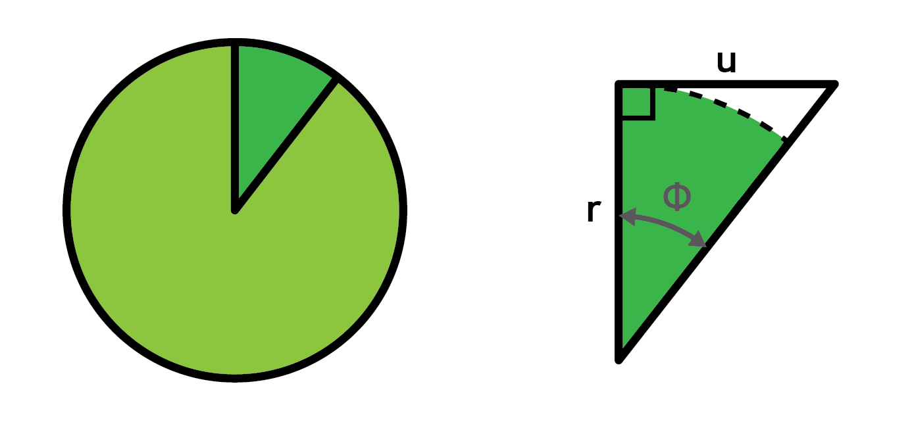
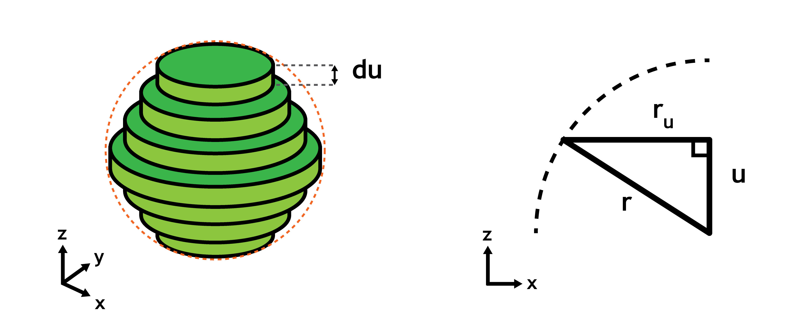

You know that feeling when you have been using some rule blindly forever and one day you finally spend the time to figure out where this rule comes from? Below is my effort to visualize the integrals which lead to the formulas for surface area and volume of spheres.

<!--more-->

## Circle Circumference

To compute the circumference $$U$$ let's chop up the circle in $$n$$ triangles with $$\phi = \frac{2\pi}{n}$$. One of them is highlighted above. The length of side $$u$$ can be computed the following way:

$$
\begin{aligned}
u = r \cdot \tan(\phi)
\end{aligned}
$$

By considering this side $$n$$ times we approximate the circumference:

$$
\begin{aligned}
U = n \cdot u = n \cdot r \cdot \tan\left(\frac{2\pi}{n}\right)
\end{aligned}
$$

Now, with increasing $$n$$ our approximation becomes more precise. In the limit we can drop the tangent because of the [small angle approximation](https://en.wikipedia.org/wiki/Small-angle_approximation).

$$
\begin{aligned}
U = \lim_{n \to \infty} n \cdot r \cdot \tan\left(\frac{2\pi}{n}\right) = \lim_{n \to \infty} n \cdot r \cdot \frac{2\pi}{n} = 2\pi r
\end{aligned}
$$

## Circle Area

The approach to determine area $$A$$ is quite similar. This time the area of the $$n$$ triangles are considered, the area of a single triangle is defined as:

$$
\begin{aligned}
a &= \frac{1}{2} \cdot r \cdot u = \frac{1}{2} \cdot r^2 \cdot \tan(\phi)
\end{aligned}
$$

Analogously we can approximate the area and regard the limit:

$$
\begin{aligned}
A &= n \cdot a = n \cdot \frac{1}{2} \cdot r^2 \cdot \tan\left(\frac{2\pi}{n}\right) \\ \\
A &= \lim_{n \to \infty} n \cdot \frac{1}{2} \cdot r^2 \cdot \tan\left(\frac{2\pi}{n}\right) = \lim_{n \to \infty} n \cdot \frac{1}{2} \cdot r^2 \cdot \frac{2\pi}{n} = \pi r^2
\end{aligned}
$$

## Surface Area of a Sphere

When decomposing the the sphere surface in lots of small quads we can approximate the surface area. The sides are defined as:

$$
\begin{aligned}
  b &= \frac{d\phi_b}{2\pi} \cdot 2\pi r = d\phi_b \cdot r \\ \\
  a &= \frac{d\phi_a}{2\pi} \cdot 2\pi r_a = d\phi_b \cdot r_a \\ \\
r_a &= r \cdot \cos\left(\phi_b\right)
\end{aligned}
$$

The area of a quad is simply:

$$
\begin{aligned}
A_{quad} = a \cdot b = r^2 \cos\left(\phi_b\right) ~ d\phi_b ~ d\phi_a
\end{aligned}
$$

In the limit the quads become infinitesimal and the approximation converges to the correct solution. This time an integration over $$\phi_a$$ and $$\phi_b$$ does the job. The way the integral is constructed it "moves along the z-axis", after each step in $$\phi_b$$ it sums up the areas of all quads along this "latitude of the sphere".

Please note that this integral only considers an eigth of the actual sphere. Accordingly, a factor of $$8$$ is included.

$$
\begin{aligned}
A &= 8 \cdot \int_0^{\frac{1}{2} \pi} \int_0^{\frac{1}{2} \pi} A_{quad} \\ \\
&= 8 \cdot \int_0^{\frac{1}{2} \pi} \int_0^{\frac{1}{2} \pi} r^2 \cos\left(\phi_b\right) ~ d\phi_b ~ d\phi_a \\ \\
&= 8 r^2 \cdot \int_0^{\frac{1}{2} \pi} \bigg\lvert \sin\left(\phi_b \right) \bigg\rvert _0^{\frac{1}{2}\pi} ~ d\phi_a \\ \\
&= 8 r^2 \cdot \int_0^{\frac{1}{2} \pi} \left(\sin\left(\frac{1}{2}\pi\right) - \sin(0) \right) ~ d\phi_a \\ \\
&= 8 r^2 \cdot \int_0^{\frac{1}{2} \pi} ~ d\phi_a \\ \\
&= 8 r^2 \cdot \frac{1}{2} \pi \\ \\
&= 4 \pi r^2
\end{aligned}
$$

## Volume of a Sphere

For the volume a different kind of decomposition is chosen. As depicted above the sphere can be approximated with a set of thin disks. The radius of each disk is defined as:

$$
\begin{aligned}
r_u &= \sqrt{r^2 - u^2}
\end{aligned}
$$

Using the formula for the area of a circle the volume of a disk is:

$$
\begin{aligned}
V_{disk} = \pi {r_u}^2 \cdot du
\end{aligned}
$$

Integration over $$u$$ leads to infinitesimally thin disks and convergence to the correct solution. Please note that the integral below only considers one half of the sphere, to account for that a factor of $$2$$ is included.

$$
\begin{aligned}
V &= 2 \cdot \int_0^r V_{disk} \\ \\
&= 2 \cdot \int_0^r \pi {r_u}^2 ~ du \\ \\
&= 2 \cdot \int_0^r \pi (r^2 - u^2) ~ du \\ \\
&= 2 \pi \left( r^2 \int_0^r du - \int_0^r u^2 ~du \right) \\ \\
&= 2 \pi \left( r^2 \cdot r - \bigg\lvert \frac{1}{3} u^3 \bigg\rvert _0^r \right) \\ \\
&= 2 \pi \left( r^3 - \frac{1}{3} r^3 \right) \\ \\
&= \frac{4}{3} \pi r^3
\end{aligned}
$$
